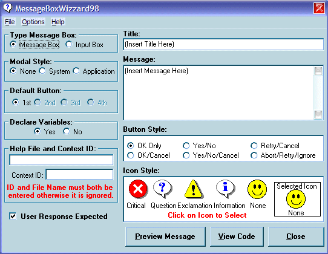



## MessageBoxWizzard98

### Description

This is an add-in that I wrote for VB6 when it was first released. The wizard creates a Message Box or Input box and lets you fully select the parameters for your box.

See the zip file for the complete project to compile the DLL. Once complied, register the the DLL. Close VB and reopen VB. Go to Add-Ins and open the Add-In manager and check Loaded/Unloaded and Load on Startup. Close the Add-In Manager and the Wizard should be listed on your Add-ins list.

There is an included document "MsgWiz.rtf" that explains how to use the program.

I originaly released this as shareware and still has a crude copyguard contained within it. To register the wizard to get rid of the nag screen, the code is KXP4410. If you would like to register the code, the information is on the Help/About screen.
 
### More Info
 
This is an addin for VB6

Generates the complete code for a message box or input box

             |
---                |---
**Submitted On**   |2001-12-18 10:14:00
**By**             |[Leo Mrozek](https://github.com/Planet-Source-Code/PSCIndex/blob/master/ByAuthor/leo-mrozek.md)
**Level**          |Beginner
**User Rating**    |5.0 (20 globes from 4 users)
**Compatibility**  |VB 6\.0
**Category**       |[Complete Applications](https://github.com/Planet-Source-Code/PSCIndex/blob/master/ByCategory/complete-applications__1-27.md)
**World**          |[Visual Basic](https://github.com/Planet-Source-Code/PSCIndex/blob/master/ByWorld/visual-basic.md)
**Archive File**   |[MessageBox4287412182001\.zip](https://github.com/Planet-Source-Code/leo-mrozek-messageboxwizzard98__1-29924/archive/master.zip)

